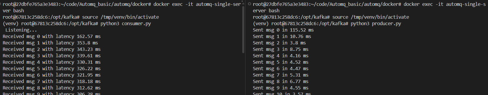
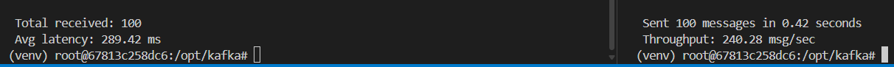

# AutoMQ Basic Producer & Consumer 

# Introduction
AutoMQ is a Kafka-compatible, cloud-native messaging and streaming platform designed for high scalability, low latency, and cost efficiency. It leverages cloud infrastructure to provide a serverless Kafka alternative, maintaining compatibility with Kafka APIs while optimizing for cloud environments.

AutoMQ Deployment Scenarios:

* **Streaming Data**: From IoT, logs, user events
* **Microservices**: For event-driven communication
* **Big Data**: Send data to tools like Spark/Flink
* **Messaging**: For apps like e-commerce, finance, gaming


# Architecture


### Detailed Components

#### 1. **Streaming Data**
Represents the incoming data flow from producers (applications using Kafka clients in Java or Python) to the AutoMQ system.
  - Data streams are ingested into the stateless broker for processing.
  - The dashed lines indicate the continuous flow of data into the system.

This is the entry point for all messages or events that need to be processed, stored, and delivered to consumers.

#### 2. **Stateless Broker**
- **Description**: The central component, labeled "Stateless Broker" consists of multiple broker instances, each with a computing layer and an S3Stream module. Think of the stateless broker as a team of air traffic controllers who direct planes (messages) to their destinations without needing to store the planes themselves—storage is handled elsewhere (cloud storage).

- **Components**:
  - **Broker**: Multiple broker instances handle message routing and processing.
  - **Computing Layer**: Manages the logic for handling topics, partitions, and message distribution.
  - **S3Stream**: A module that interfaces with the shared cloud storage for data persistence.
- **Function**: 
  - Brokers receive streaming data and process it using the computing layer.
  - Being stateless, they do not store data locally; instead, they rely on the shared cloud storage for persistence via S3Stream.


#### 3. **Shared Cloud Storage**
- **Description**: A "Shared Cloud Storage" which serves as the persistent storage layer for the entire system. Offloading storage to the cloud eliminates the need for local disks on broker nodes, enhancing scalability and reducing costs.
- **Components**:
  - **WAL Storage**: Includes various Write-Ahead Log options:
    - **WAL Storage**: Generic WAL for logging transactions.
    - **EBBS WAL**: Elastic Block Store WAL, likely using AWS EBS.
    - **S3 WAL**: Direct integration with S3 for WAL.
    - **NFS WAL**: Network File System-based WAL.
  - **Main Storage**: 
    - **Object Storage (S3)**: The primary storage layer using cloud object storage (Amazon S3).
- **Function**: 
  - WAL storage ensures durability by logging all changes before they are applied, supporting crash recovery.
  - Object Storage (S3) holds the main data corpus, providing scalable and cost-effective long-term storage.


#### 4. **Automatic Controller**
- **Description**: An "Automatic Controller" that oversees the system's operation and optimization. This is like a smart building manager who monitors occupancy (metrics), adjusts the number of staff (auto scaling), and reassigns tasks (auto balancing) to keep everything running smoothly.
- **Components**:
  - **Metrics Collector**: Gathers performance metrics such as throughput, latency, and resource usage.
  - **Auto Scaling**: Dynamically adjusts the number of broker instances based on load.
  - **Auto Balancing**: Distributes load evenly across brokers and storage resources.
- **Function**: 
  - Monitors the system in real-time using metrics collected by the Metrics Collector.
  - Automatically scales the number of brokers up or down and balances the workload to maintain performance and efficiency.


### Workflow
1. **Data Ingestion**:
   - Streaming data enters the stateless broker through multiple broker instances.
   - The computing layer processes the data.

2. **Data Persistence**:
   - The S3Stream module within each broker writes data to the shared cloud storage.
   - WAL storage (EBBS WAL, S3 WAL, NFS WAL) logs transactions to ensure durability.
   - The main data is stored in the Object Storage (S3) layer for long-term retention.

3. **Automation and Optimization**:
   - The Automatic Controller continuously collects metrics via the Metrics Collector.
   - Based on these metrics, it triggers Auto Scaling to add or remove broker instances and uses Auto Balancing to redistribute the workload across the system.

4. **Data Delivery**:
   - Consumers retrieve data from the brokers, which fetch it from the shared cloud storage as needed.
   - The stateless nature ensures that brokers can scale independently without being tied to local storage.

 This design is akin to a cloud-based logistics network where data (packages) is processed by a distributed team (brokers), stored in a central warehouse (cloud storage), and managed by an intelligent system (controller) to handle fluctuating demand. 

## **Event Streaming Process by AutoMQ**


### Detailed Components

#### 1. **Producers**
- **Description**: Producers are client applications (Java and Python language based) that send messages to AutoMQ.
- **Process**: 
  - Producers use the **Kafka API Gateway** to send messages via the Kafka protocol.
  - The gateway routes these messages to the stateless broker for processing.
- **Example**: A Python script using `kafka-python` using Kafka’s standard client API can produce messages to topics like `Topic 1`, `Topic 2`, or `Topic n`.

#### 2. **Consumers**
- **Description**: Consumers are client applications that receive messages from AutoMQ based on their subscribtion. Similar to producers, they support Java and Python.
- **Process**: 
  - Consumers request messages through the **Kafka API Gateway** using the Kafka protocol.
  - The gateway retrieves messages from the computing layer and delivers them to the consumers.
- **Example**: A Python consumer script using `kafka-python` can subscribe to `test-topic` and process incoming messages.

AutoMQ primarily follows the Publish-Subscribe (Pub/Sub) model, where the **producer publishes messages to a topic**, and the **consumer subscribes to that topic to consume messages**. In between, a **computing layer and cloud storage** work together to form a **highly scalable architecture**.
Here is the Pub/Sub model diagram:

   

* **Publishers** (on the left) send messages.
* The **Message Broker** receives those messages and stores them in a **Topic**.
* **Subscribers** (on the right) receive messages from the topic they subscribed to.

> Publishers and Subscribers don’t talk to each other directly — they communicate **through the broker**.


#### 3. **Kafka API Gateway**
- **Description**: Acts as an entry point for both producers and consumers, exposing Kafka-compatible APIs on port 9092.
- **Function**: 
  - Routes incoming "Produce" requests from producers to the stateless broker.
  - Handles "Consume" requests by fetching messages from the computing layer and delivering them to consumers.

#### 4. **Stateless Broker**
- **Description**: A central component, representing the core message routing mechanism.
- **Function**: 
  - Acts as an intermediary that receives messages from the Kafka API Gateway and forwards them to the appropriate topics in the computing layer.
  - Being stateless, it does not store messages persistently; instead, it relies on the S3 bucket object storage for data persistence.

#### 5. **Computing Layer**
- **Description**: The "Computing Layer" contains the logic for managing topics and their partitions. Partitioning allows AutoMQ to scale horizontally by distributing load across multiple nodes.
- **Components**:
  - **Topics**: Represent logical channels for message streams (`Topic 1`, `Topic 2`, `Topic n`).
  - **Partitions**: Each topic is divided into partitions (`Partition0`, `Partition1`) to enable parallel processing and scalability.
- **Function**: 
  - Organizes messages into topics and partitions based on the producer’s input.
  - Interacts with the S3 bucket object storage to store and retrieve messages.

#### 6. **S3 Bucket Object Storage**
- **Description**: "S3 bucket Object Storage," indicating the use of cloud-based object storage. This is like a secure vault where all letters (messages) are archived after being sorted, ensuring they can be retrieved later by consumers.
- **Function**: 
  - Stores messages persistently, allowing the stateless broker to offload data retention.
  - Provides durable and scalable storage for all topics and partitions.

#### 7. **Automatic Controller**
  - Monitors the system and collects metrics to ensure optimal performance.
  - Automatically scales the computing layer up or down and balances partitions to handle traffic spikes or drops.


### Workflow
1. **Message Production**:
   - Producers send messages via the Kafka API Gateway using the Kafka protocol.
   - The gateway forwards these messages to the stateless broker.
   - The broker directs the messages to the appropriate topic and partition in the computing layer.
   - Messages are then stored in the S3 bucket object storage for persistence.

2. **Message Consumption**:
   - Consumers request messages through the Kafka API Gateway.
   - The gateway retrieves messages from the computing layer, which fetches them from the S3 bucket.
   - The broker delivers the messages to the consumers via the gateway.

3. **Automation and Monitoring**:
   - The Automatic Controller continuously collects metrics and adjusts scaling and balancing based on system demand.
   - This ensures the system remains efficient and responsive to varying workloads.

This makes AutoMQ ideal for real-time streaming applications in IoT, microservices, and big data workflows.


# Task Description
The primary objectives of this lab are as follows:

 1. To deploy AutoMQ on a Linux VM
 2. To implement Python-based producer and consumer scripts to stream messages.
 3. To monitor performance metrics like throughput and latency.

## Prerequisites

- **System Requirements**: 
    - Linux-based VM (Ubuntu 20.04+)
    - 4GB+ RAM
    - 20GB+ disk.

- **Tools Needed**: Docker, Docker Compose, Python 3, Git, JDK 17.

- **Network**: Port 9092 open for Kafka communication.
  - AutoMQ (Kafka-compatible) uses port 9092 for client communication, ensuring producers and consumers can connect to the broker.

---

## Task 1: Deploying Kafka-Compatible Messaging with AutoMQ

### Deploy AutoMQ

1. **Clone AutoMQ Repository**

   ```bash
   git clone https://github.com/AutoMQ/automq.git
   cd automq
   ```

   - Cloning the AutoMQ repository downloads the source code needed to build and deploy AutoMQ.

2. **Install JDK**

   ```bash
   sudo apt update
   sudo apt install openjdk-17-jdk -y
   java -version     #verifies the installation
   ```

   -  AutoMQ requires Java (JDK 17) to compile and run. Updating the package index ensures the latest JDK version is installed.

3. **Add Swap Temporarily**

   ```bash
   fallocate -l 2G /swapfile
   chmod 600 /swapfile
   mkswap /swapfile
   swapon /swapfile
   export JAVA_HOME=/usr/lib/jvm/java-17-openjdk-amd64
   export GRADLE_OPTS="-Xmx512m"
   ```

   - Swap space prevents memory exhaustion during the build process on low-RAM systems. Setting `JAVA_HOME` points to the JDK location, and `GRADLE_OPTS` limits Gradle’s memory usage to avoid crashes.

4. **Check memory**

   ```bash
   free -h
   df -h
   ```

   - These commands verify that swap space is active and sufficient, ensuring the system can handle the build without running out of memory.

5. **Build AutoMQ**

   ```bash
   ./gradlew releaseTarGz -x test -x check --no-daemon --info
   ```

   - This command uses Gradle to build AutoMQ and create a `.tgz` package, skipping tests and checks to speed up the process. The `--no-daemon` flag ensures a clean build, and `--info` provides detailed output for debugging.

   ## Expected Output:
    


6. **Copy `.tgz` to Docker Folder**

   ```bash
   cd core/build/distributions
   tar -xzf kafka-3.9.0-SNAPSHOT.tgz
   ls -l
   cd kafka-3.9.0-SNAPSHOT
   
   # Rename the file because the Dockerfile expects the archive to be named 'automq-3.9.0-SNAPSHOT.tgz'
   mv /root/code/Automq_basic/automq/core/build/distributions/kafka-3.9.0-SNAPSHOT.tgz /root/code/Automq_basic/automq/core/build/distributions/automq-3.9.0-SNAPSHOT.tgz  
  
   cp automq-3.9.0-SNAPSHOT.tgz /root/code/Automq_basic/automq/docker/
   ```

   - The build process creates a `.tgz` file, which needs to be extracted and moved to the Docker directory for image creation. Copying to the Docker folder prepares it for the next step.

   Core Folder Structure: Location of .tgz file.

   

7. **Build Docker Image**

   ```bash
   cd docker
   docker build -t automqinc/automq:1.6.0 .
   ```

   - This command builds a custom Docker image for AutoMQ using the `.tgz` file, tagging it as `1.6.0`. The image encapsulates AutoMQ and its dependencies for consistent deployment.

8. **Run Docker Compose**

   ```bash
   docker-compose up -d
   ```

   - Docker Compose starts the AutoMQ container in detached mode (`-d`), setting up the broker and required services based on the `docker-compose.yml` configuration.

   ## Expected Output:

   

9. **Check Broker Logs**

   ```bash
   docker-compose ps 
   docker logs automq-single-server | tail -n 50
   ```

   - Viewing the last 50 lines of logs confirms that the AutoMQ broker is running correctly and helps diagnose startup issues, such as misconfigurations or port conflicts.

---

## Task 2: Producing and Consuming Events with AutoMQ Using Python Kafka-Compatible Clients

### Set Up Python Environment

1. **Install Python Dependencies**

   ```bash
   apt update
   apt install -y python3-venv python3-pip
   ```

   - Python 3 and `pip` are needed to run the producer/consumer scripts, and `python3-venv` enables isolated environments. Updating the package index ensures the latest versions.

2. **Create Virtual Environment**

   ```bash
   cd automq/docker

   python3 -m venv /tmp/venv

   source /tmp/venv/bin/activate

   pip install --upgrade pip
   pip install kafka-python
   ```

   -  A virtual environment isolates Python dependencies, preventing conflicts. Activating it sets the context for installing `kafka-python`, the Kafka client library used for producer/consumer scripts. Upgrading `pip` ensures compatibility with the latest packages.

3. **Verify Broker Configuration**
     
   From this `config/broker.properties` file:
     
   Ensure:
   ```
   listeners=PLAINTEXT://:9092
   advertised.listeners=PLAINTEXT://localhost:9092
   ```

   - Verifying `listeners` and `advertised.listeners` ensures clients can connect to the broker on port 9092.

---

### Create Producer and Consumer

1. **Access Container**

   ```bash
   docker exec -it automq-single-server bash
   ```

   - This command opens a shell inside the AutoMQ container, allowing you to create and run Python scripts in the same environment as the broker, avoiding network issues.

2. **Create Producer Script**

   ```bash
   cat > producer.py << 'EOF'
   from kafka import KafkaProducer
   import json
   import time

   producer = KafkaProducer(
       bootstrap_servers='localhost:9092',
       value_serializer=lambda v: json.dumps(v).encode('utf-8')
   )

   topic = 'test-topic'
   total_sent = 0
   start_time = time.time()

   for i in range(100):
       t0 = time.time()
       message = {'id': i, 'msg': f'Hello AutoMQ {i}', 'ts': t0}
       producer.send(topic, value=message)
       producer.flush()
       t1 = time.time()
       print(f"Sent msg {i} in {round((t1 - t0)*1000, 2)} ms")
       total_sent += 1

   end_time = time.time()
   duration = end_time - start_time
   print(f"\nSent {total_sent} messages in {round(duration, 2)} seconds")
   print(f"Throughput: {round(total_sent / duration, 2)} msg/sec")
   EOF
   ```

   - The producer script sends 100 JSON messages to the `test-topic`, measuring the time taken for each send and calculating throughput. Writing it directly with `cat` ensures accuracy and avoids manual editing errors. 
   - The `producer.py` script sends messages to a specific Kafka topic (`test-topic`).
   - It uses the Kafka client API to publish the messages, which is the role of a **publisher** in the Pub/Sub model.

3. **Create Consumer Script**

   ```bash
   cat > consumer.py << 'EOF'
   from kafka import KafkaConsumer
   import json
   import time

   consumer = KafkaConsumer(
       'test-topic',
       bootstrap_servers='localhost:9092',
       auto_offset_reset='latest',
       group_id='test1-monitor',
       value_deserializer=lambda m: json.loads(m.decode('utf-8'))
   )

   print("Listening...")

   total_received = 0
   latencies = []

   for message in consumer:
       receive_ts = time.time()
       sent_ts = message.value.get('ts', receive_ts)
       latency = receive_ts - sent_ts
       latencies.append(latency)
       total_received += 1

       print(f"Received msg {message.value['id']} with latency {round(latency*1000, 2)} ms")

       if total_received >= 100:
           break

   avg_latency = sum(latencies) / len(latencies)
   print(f"\nTotal received: {total_received}")
   print(f"Avg latency: {round(avg_latency * 1000, 2)} ms")
   EOF
   ```

   - The consumer script reads messages from `test-topic`, calculates latency for each message, and computes the average latency after receiving 100 messages. Using `cat` ensures the script is created correctly.
   - The `consumer.py` script receives messages from the same `test-topic` by subscribing to it.
   - As a Kafka consumer, it uses a **group ID** (`group_id='test1-monitor'`), which allows the Kafka broker to distribute messages across partitions accordingly.
   - A consumer only receives messages from the topics it has subscribed to, just like a **subscriber** in the Pub/Sub model.


4. **Verify Scripts**

   ```bash
   cat producer.py
   cat consumer.py

   # edit
   nano producer.py
   nano consumer.py

   # overwrite
   cat > producer.py << 'EOF'
   new code....
   EOF
   cat > consumer.py << 'EOF'
   new code....
   EOF
   
   # delete file
   rm producer.py consumer.py

   ```

   -  Displaying the scripts confirms they were created correctly, allowing you to check for syntax errors or missing lines before running them.

---

# Test Message Streaming

1. **Run Consumer**

   Open a terminal, activate the virtual environment, and start the consumer:

   ```bash
   docker exec -it automq-single-server bash
   source /tmp/venv/bin/activate
   cat consumer.py # For varification
   python3 consumer.py
   ```

   - The consumer must run first to listen for messages on `test-topic`. 

2. **Run Producer**

   In another terminal, access the container, activate the virtual environment, and run the producer:

   ```bash
   docker exec -it automq-single-server bash
   source /tmp/venv/bin/activate
   cat producer.py # For varification
   python3 producer.py
   ```

   - The producer sends messages to the broker, which the consumer reads.

### OUTPUT:
   
     
   
Running both inside the container ensures it uses the same environment as the broker, minimizing network issues.

## Task 3: Monitor performance metrics

   

3. **Monitor Output**
   - **Producer Output**: Displays the time taken to send each message and overall throughput (messages/second).
     -  This output helps evaluate the producer’s performance and AutoMQ’s ability to handle message sends.
   - **Consumer Output**: Shows the latency for each received message and the average latency.
     - Latency metrics indicate how quickly messages are delivered, reflecting AutoMQ’s efficiency.

### Common Issues and Fixes:

- Connection Errors: Verify bootstrap_servers='localhost:9092' and port 9092 is open.
- Low Throughput: Check VM resources (CPU, memory, disk I/O) and consider upgrading hardware.


# Conclusion
This guide demonstrates how to deploy AutoMQ, a Kafka-compatible messaging platform, on a Linux VM using Docker. By setting up a broker, creating Python producer and consumer scripts, and monitoring performance, users can understand AutoMQ’s Kafka compatibility, scalability, and cloud-native features. The process highlights:

- Successful deployment of AutoMQ with Docker Compose.
- Implementation of Kafka-compatible clients using kafka-python.
- Performance monitoring through throughput and latency metrics.
